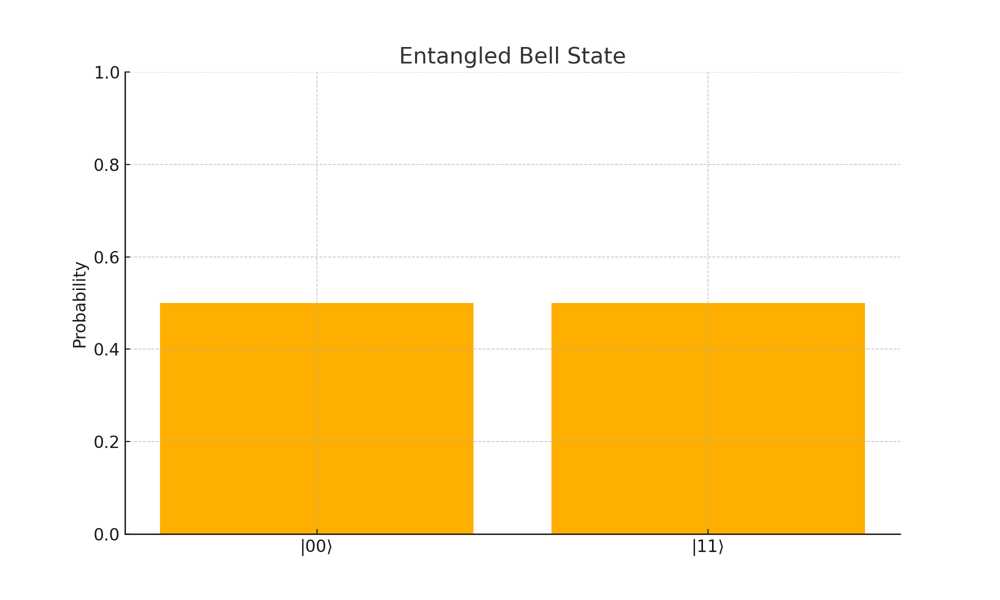
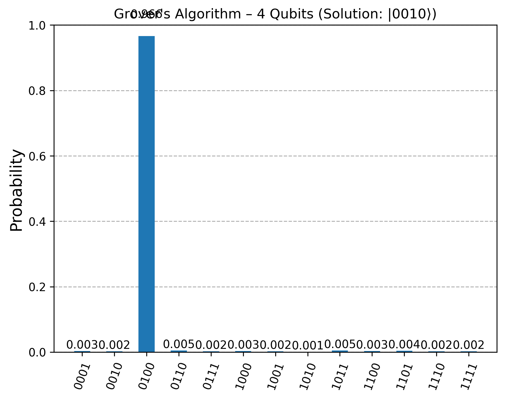

# Quantum Computing Projects - QuLearnLabs x EIT Deep Tech Talent

This repository contains practical work developed as part of the program **AI-assisted Software Engineering for Quantum Computing and Post-Quantum Cryptography**, organized by [QuLearnLabs](https://www.qulearnlabs.com/) and supported by the [EIT Deep Tech Talent Initiative](https://eit.europa.eu/our-activities/eit-deep-tech-talent-initiative).

## 🌍 Program Description

The course explores the intersection of **Quantum Computing**, **Post-Quantum Cryptography (PQC)**, and **Artificial Intelligence**, with a strong focus on hands-on learning and practical implementation of core quantum algorithms and circuit design.

🎓 As a member of the inaugural cohort, I had the opportunity to:
- Work on statevector simulations and circuit construction using Qiskit 2.0+.
- Understand and implement entanglement, superposition, Grover’s algorithm, and quantum oracles.
- Complete quizzes and a capstone project demonstrating real quantum advantage through noise-aware simulation.

## 🧠 Key Notebooks

### 1. `7.1-3 Entanglement generation.ipynb`
- Implemented and visualized Bell states and entangled quantum systems.
- Compared expected theoretical statevectors vs results from Qiskit simulations.
- Used custom function `ket_expression()` from `functions.py` to print clean LaTeX-style state vectors.

**Visualization Example:**


### 2. `7.4-6 Grover's Algorithm.ipynb`
- Focused on understanding the structure and purpose of Grover’s algorithm.
- Studied how the oracle marks a target state and how the diffuser amplifies its probability.

### 3. `7.8 Making Circuits (Quiz).ipynb`
- Practice notebook to solidify knowledge on gate placement, multi-qubit operations, and measurement ordering.

### 4. `8.1 Capstone_Project.ipynb`
- Designed and implemented a 4-qubit Grover's diffuser from scratch.
- Followed the specification and design steps outlined in the course platform.
- Analyzed the resulting statevector output to confirm correct diffuser behavior.
- Focused on circuit structure and expected amplitude distribution after applying the diffuser.

### 5. `8.2 Assignment_03.ipynb`
- Hands-on test of controlled gates, custom circuit design, and quantum logic evaluation.
- Built a 4-qubit Grover’s search circuit to find a marked state (e.g., `|0010⟩`).
- Included one iteration of oracle + diffuser, and simulated measurements using `AerSimulator`.
- Visualized search results using probability histograms and verified convergence.

**Visualization Example:**



## 🧮 Tools & Libraries
- [Qiskit 2.1.0](https://qiskit.org/)
- `AerSimulator` for executing circuits and collecting results (e.g., statevectors, counts) for visualization
- `matplotlib`, `numpy`, `scipy` for data analysis and optimization
- Custom utility: `functions.py` for clean statevector formatting

## 👨‍🔬 About Me

I’m Gabriel Castillo, a Mechatronics Engineer from Tecnológico de Monterrey, currently working as a QA Test Automation Engineer and pursuing a Master’s in Applied Artificial Intelligence. I’m deeply interested in the intersection of Quantum Computing and Artificial Intelligence, and how these two fields can converge to solve complex computational problems. This course has been a key milestone in my transition toward research and advanced studies in Quantum Technologies.

## 🔗 Related Post

🧵 [LinkedIn Announcement – QuLearnLabs Program Acceptance](https://www.linkedin.com/in/jgabriel-castillog/recent-activity/all/)

## 🧠 Sample Output

Here’s an example of one of the output statevectors visualized using our custom LaTeX-like printer:

```
(0.707+0.000j)|00⟩ + (0.707+0.000j)|11⟩
```

## 📁 Repository Structure

```
├── 7.1-3 Entanglement generation.ipynb
├── 7.4-6 Grover's Algorithm.ipynb
├── 7.8 Making Circuits (Quiz).ipynb
├── 8.1 Capstone_Project.ipynb
├── 8.2 Assignment_03.ipynb
├── functions.py
├── images/
│   ├── bell_state.png
│   └── grover_result.png
└── README.md
```

---

🧪 *Quantum mechanics shows us particles can exist in multiple states at once. Similarly, my journey in Quantum Computing is just beginning—with all paths open.*

#QuantumComputing #DeepTechTalent #Qiskit #FutureTech
