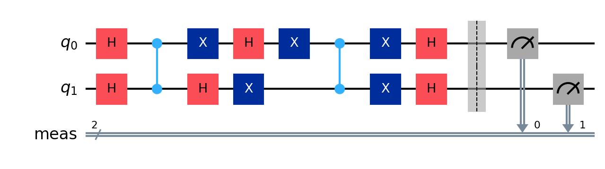

# Quantum Computing Projects - QuLearnLabs x EIT Deep Tech Talent

This repository contains practical work developed as part of the program **AI-assisted Software Engineering for Quantum Computing and Post-Quantum Cryptography**, organized by [QuLearnLabs](https://www.qulearnlabs.com/) and supported by the [EIT Deep Tech Talent Initiative](https://eit.europa.eu/our-activities/eit-deep-tech-talent-initiative).

## 🌍 Program Description

The course explores the intersection of **Quantum Computing**, **Post-Quantum Cryptography (PQC)**, and **Artificial Intelligence**, with a strong focus on hands-on learning and practical implementation of core quantum algorithms and circuit design.

🎓 As a member of the inaugural cohort, I had the opportunity to:
- Work on statevector simulations and circuit construction using Qiskit 2.0+.
- Understand and implement entanglement, superposition, Grover’s algorithm, and quantum oracles.
- Complete quizzes and a capstone project demonstrating real quantum advantage through noise-aware simulation.

## 🧠 Key Notebooks

### 1. `7.1-3 Entanglement generation.ipynb`
- Implemented and visualized Bell states and entangled quantum systems.
- Compared expected theoretical statevectors vs results from Qiskit simulations.
- Used custom function `ket_expression()` from `functions.py` to print clean LaTeX-style state vectors.

**Circuit in Qiskit:**


**Probability Graph:**


### 2. `7.4-6 Grover's Algorithm.ipynb`
- Focused on understanding the structure and purpose of Grover’s algorithm.
- Studied how the oracle marks a target state and how the diffuser amplifies its probability.

**Circuit in Qiskit for Grover Algorithm with solution |00>:**


**Circuit in Qiskit for Grover Algorithm with solution |01>:**


**Circuit in Qiskit for Grover Algorithm with solution |10>:**



**Circuit in Qiskit for Grover Algorithm with solution |11>:**


### 3. `7.8 Making Circuits (Quiz).ipynb`
- Practice notebook to solidify knowledge on gate placement, multi-qubit operations, and measurement ordering.

### 4. `8.1 Capstone_Project.ipynb`
The goal of the Capstone Project was to design and implement **Grover's algorithm** from scratch using Qiskit for a 4-qubit quantum system, targeting the solution state:

\[
|0010\rangle
\]

This corresponds to a search space of 16 possible states, where the goal is to amplify the probability of the target state using the principles of Grover's algorithm.

The implementation followed the steps outlined in the course:

1. **Initialize** all qubits into superposition using Hadamard gates.
2. Implement a custom **oracle** to mark the target state `|0010⟩` with a negative phase.
3. Implement the **Grover diffuser**, also known as the inversion-about-the-mean operator.
4. **Repeat** the Grover iteration (oracle + diffuser) 3 times, which is optimal for 4 qubits.
5. **Measure** the circuit to observe the final state.

The circuit was built using modular functions for clarity and reusability.

I used `AerSimulator` with 1000 shots to evaluate the final circuit. After measurement, the state `'0100'` (which represents `|0010⟩` in Qiskit's bit order) appeared with **very high probability**, confirming that the algorithm worked as expected.

To visualize the result, we normalized the counts into probabilities and plotted a histogram. The output showed a sharp peak at the expected state.

**Circuit in Qiskit:**


**Probability Graph:**


### 5. `8.2 Assignment_03.ipynb`
The goal of this assignment is to design and implement a quantum circuit that generates the following entangled state with 3 qubits, known as a **GHZ state**:

\[
|\psi\rangle = \frac{1}{\sqrt{2}} \left( |000\rangle + |111\rangle \right)
\]

This quantum state represents maximal entanglement between three qubits, where measurement of one qubit immediately determines the others.

We used Qiskit to build a circuit starting from the basis state `|000⟩`. The circuit applies:

1. A **Hadamard gate** to qubit 0 to create superposition.
2. A **CNOT gate** from qubit 0 to qubit 1.
3. A **CNOT gate** from qubit 0 to qubit 2.

This sequence entangles the three qubits into the desired GHZ state:

```python
ent_circ.h(0)
ent_circ.cx(0, 1)
ent_circ.cx(0, 2)
```
**Circuit in Qiskit:**


**Probability Graph:**


## 🧮 Tools & Libraries
- [Qiskit 2.1.0](https://qiskit.org/)
- `AerSimulator` for executing circuits and collecting results (e.g., statevectors, counts) for visualization
- `matplotlib`, `numpy`, `scipy` for data analysis and optimization
- Custom utility: `functions.py` for clean statevector formatting

## 👨‍🔬 About Me

I’m Gabriel Castillo, a Mechatronics Engineer from Tecnológico de Monterrey, currently working as a QA Test Automation Engineer and pursuing a Master’s in Applied Artificial Intelligence. I’m deeply interested in the intersection of Quantum Computing and Artificial Intelligence, and how these two fields can converge to solve complex computational problems. This course has been a key milestone in my transition toward research and advanced studies in Quantum Technologies.

## 🔗 Related Post

🧵 [LinkedIn Announcement – QuLearnLabs Program Acceptance](https://www.linkedin.com/in/jgabriel-castillog/recent-activity/all/)

## 🧠 Sample Output

Here’s an example of one of the output statevectors visualized using our custom LaTeX-like printer:

```
(0.707+0.000j)|00⟩ + (0.707+0.000j)|11⟩
```

## 📁 Repository Structure

```
├── 7.1-3 Entanglement generation.ipynb
├── 7.4-6 Grover's Algorithm.ipynb
├── 7.8 Making Circuits (Quiz).ipynb
├── 8.1 Capstone_Project.ipynb
├── 8.2 Assignment_03.ipynb
├── functions.py
├── images/
│   ├── bell_state.png
│   └── grover_result.png
└── README.md
```

---

🧪 *Quantum mechanics shows us particles can exist in multiple states at once. Similarly, my journey in Quantum Computing is just beginning—with all paths open.*

#QuantumComputing #DeepTechTalent #Qiskit #FutureTech
